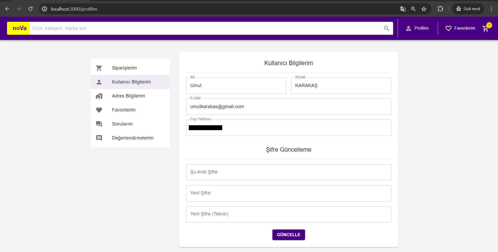

# eCommerce Projesi

Bu proje, Bandırma Onyedi Eylül Üniversitesi Yazılım Mühendisliği bitirme projesi olarak Umut Karakaş ve Mustafa Mutlu tarafından geliştirilmiştir. Modern ve kullanıcı dostu bir e-ticaret platformu geliştirmeyi amaçlamaktadır. Bu platform, ürün arama ve filtreleme, satıcı ve yönetici panelleri ile gerçek zamanlı stok bilgisi gibi özellikleri içermektedir.

## Proje Özeti

- **Frontend**: React, Material-UI
- **Backend**: Node.js, Sequelize
- **Veritabanı**: MySQL

## Özellikler

- Kullanıcılar ürünleri kolayca arayabilir ve filtreleyebilir
- Satıcı ve yönetici panelleri
- Gerçek zamanlı stok bilgisi
- Satıcılar hesap oluşturabilir ve ürün satabilir
- Kullanıcılar hızlıca sipariş verebilir

## Kurulum

### Gereksinimler

- Node.js
- MySQL

### Adımlar

1. Projeyi klonlayın:
    ```bash
    git clone https://github.com/mmutlucod/eCommerce.git
    ```

2. Proje dizinine gidin:
    ```bash
    cd eCommerce
    ```

3. Gerekli bağımlılıkları yükleyin:
    ```bash
    npm install
    ```

4. Veritabanı ayarlarını yapın ve veritabanını oluşturun. `config/config.json` dosyasını düzenleyin:
    ```json
    {
      "development": {
        "username": "root",
        "password": null,
        "database": "ecommerce_db",
        "host": "127.0.0.1",
        "dialect": "mysql"
      }
    }
    ```

5. Veritabanı migrasyonlarını çalıştırın:
    ```bash
    npx sequelize-cli db:migrate
    ```

6. Uygulamayı başlatın:
    ```bash
    npm start
    ```

## Kullanım

### Kullanıcı Arayüzü

- Ana sayfada popüler ürünleri görüntüleyin.
- Ürün arama ve filtreleme özelliklerini kullanarak aradığınız ürünü bulun.
- Ürün detay sayfasında ürün hakkında bilgi edinin ve sepete ekleyin.
- Sepet sayfasında ürünlerinizi görüntüleyin ve ödeme yapın.

### Satıcı Arayüzü

- Hesap oluşturun ve giriş yapın.
- Yeni ürünler ekleyin ve mevcut ürünlerinizi yönetin.

### Yönetici Paneli

- Yönetici olarak giriş yapın.
- Tüm kullanıcıları, ürünleri ve siparişleri yönetin.
- Platformun genel ayarlarını düzenleyin.

## Ekran Görüntüleri

Ana Sayfa:


Ürün Listesi:


Giriş Yap:


Üye Ol:


Arama:


Arama Sonuçları:


Ürün Detay:


Ürün Açıklaması:


Ürün Yorumları:


Değerlendirme Ekle:


Sorular ve Cevaplar:


Soru Sor:


Diğer Satıcılar:


Kategori Sonuçları:


Marka Sonuçları:


Satıcı Bilgileri:


Satıcı Detayları:


Siparişlerim:


Sipariş Detayları:


Profilim:


Adres Bilgilerim:


Adres Ekle:


Favorilerim:


Sorularım:


Değerlendirmelerim:


## Katkıda Bulunma

Katkıda bulunmak isterseniz, lütfen bir pull request gönderin veya bir sorun (issue) açın.

## Lisans

Bu proje MIT lisansı ile lisanslanmıştır. Daha fazla bilgi için `LICENSE` dosyasına bakın.

---

Bu projeye dair herhangi bir sorunuz varsa, lütfen bizimle iletişime geçmekten çekinmeyin.
